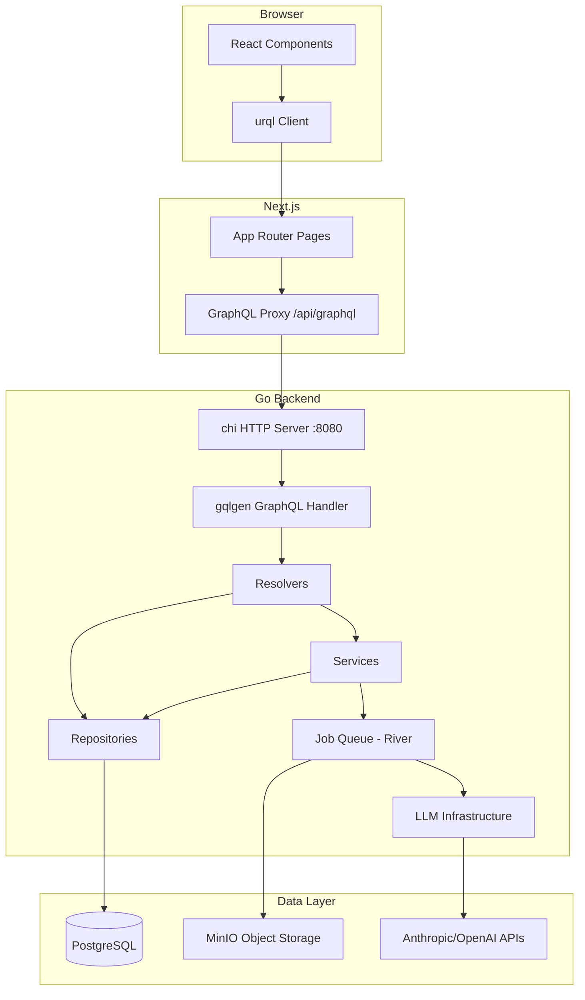

---
# credfolio2-67n7
title: Review current backend types, flows, and API design
status: completed
type: task
priority: normal
created_at: 2026-02-06T12:03:21Z
updated_at: 2026-02-08T11:20:39Z
---

Conduct a thorough review of the full-stack codebase (backend, frontend, and LLM integrations) to assess clarity, consistency, and correctness of types, flows, and the GraphQL API surface.

## Approach

Use all three specialized review subagents (via Task tool) to perform comprehensive code review:
- `@review-backend` — Staff-level Go/Backend review
- `@review-frontend` — Staff-level React/Next.js review  
- `@review-ai` — Staff-level LLM/AI engineering review

This review will be conducted against a temporary draft PR created specifically for comprehensive codebase assessment.

## Goals

1. **Type review** — Audit types across all layers:
   - Go types (models, DTOs, GraphQL schema types) for clarity of naming, purpose, and freedom from redundancy
   - TypeScript types (GraphQL generated types, component props, React state)
   - Are there overlapping types that could be consolidated? 
   - Are type boundaries between layers (DB models, domain types, GraphQL types, frontend types) clean?

2. **Flow review** — Trace the key processing flows end-to-end:
   - Document upload and detection
   - Resume extraction and materialization
   - Reference letter extraction and validation
   - Frontend GraphQL query/mutation patterns
   - Assess whether each step has a clear responsibility
   - Look for unnecessary indirection, duplicated logic, or confusing handoffs

3. **API review** — Evaluate the GraphQL schema as the contract between frontend and backend:
   - Consistency in naming conventions (queries, mutations, input types, enums)
   - Whether the API surface accurately represents the domain
   - Mutations that could be consolidated or queries that expose internal implementation details
   - Frontend usage patterns of the GraphQL API

4. **LLM integration review** — Assess prompt engineering and extraction quality:
   - Prompt construction and safety (injection risks)
   - Output validation and schema design
   - Model selection appropriateness
   - Error handling and resilience

5. **Interaction graph** — Document the full-stack system interactions:
   - Backend: services, workers, storage, LLM calls, database
   - Frontend: React component tree, GraphQL client flow, state management
   - Data flow: browser → Next.js → GraphQL → Go backend → PostgreSQL/MinIO/LLM
   - Identify flows that seem overly complex or don't make sense

## Key areas to examine

**Backend:**
- `src/backend/internal/domain/` — domain types and repository interfaces
- `src/backend/internal/graphql/` — schema, resolvers, converters
- `src/backend/internal/service/` — business logic (materialization, etc.)
- `src/backend/internal/job/` — background workers (detection, processing)
- `src/backend/internal/infrastructure/llm/` — LLM providers and extraction
- `src/backend/internal/repository/postgres/` — data access layer
- `src/backend/migrations/` — database schema

**Frontend:**
- `src/frontend/src/app/` — Next.js pages and routing
- `src/frontend/src/components/` — React components (profile, upload, UI)
- `src/frontend/src/graphql/` — queries, mutations, generated types
- `src/frontend/src/lib/urql/` — GraphQL client setup

**LLM Integration:**
- `src/backend/internal/infrastructure/llm/extraction.go` — prompts and schemas
- `src/backend/internal/job/*_processing.go` — LLM invocation patterns

## Checklist

### Setup
- [x] Create feature branch for review: `chore/credfolio2-67n7-review-current-backend-types-flows-and-api-design`
- [x] Create draft PR with current `main` branch as both base and head (or create empty commit as baseline)
- [x] Verify PR exists and is accessible to review agents

### Review Execution
- [x] Run `@review-backend` subagent (via Task tool) against the PR
- [x] Run `@review-frontend` subagent (via Task tool) against the PR
- [x] Run `@review-ai` subagent (via Task tool) against the PR
- [x] Collect all review findings from PR comments

### Documentation Structure Setup
- [x] Create `/documentation` directory at repository root
- [x] Create `/documentation/reviews/` subdirectory for review artifacts
- [x] Create `CLAUDE.md` files in source directories pointing to documentation:
  - `/src/backend/CLAUDE.md` → points to backend architecture docs
  - `/src/frontend/CLAUDE.md` → points to frontend architecture docs

### Analysis and Documentation
- [x] Synthesize findings from all three review agents into cohesive assessment
- [x] Create comprehensive review document: `/documentation/reviews/2026-02-08-comprehensive-codebase-review.md`
- [x] Document type architecture across layers (DB → Domain → GraphQL → Frontend)
- [x] Trace and document each major flow with sequence diagrams or detailed descriptions
- [x] Create full-stack interaction graph (Mermaid diagram preferred, text description as fallback)
- [x] Categorize findings: Critical issues / Warnings / Suggestions / Questions
- [x] Document what's clean and well-designed (positive findings)

### Follow-up Bean Creation
- [x] Create parent epic bean for all review findings: `credfolio2-nihn - Codebase Review Findings`
- [x] Create child beans for each major finding category (to be refined separately):
  - credfolio2-offq: Fix LLM security vulnerabilities
  - credfolio2-35s5: Fix performance bottlenecks
  - credfolio2-72p8: Fix data integrity issues
  - credfolio2-v27d: Improve type system consistency
  - credfolio2-6ps0: Code quality improvements

### Cleanup
- [x] Close the temporary review PR (do not merge) - PR #135 closed
- [ ] Delete the review feature branch (will be deleted after PR #136 merges)
- [x] Link the epic bean to this bean as a follow-up (credfolio2-nihn)

## Implementation Plan

### Approach

This is a review and documentation task that leverages the three specialized code review subagents. The review will be comprehensive but non-blocking — findings will be documented for triage and follow-up rather than requiring immediate fixes.

### Files to Create/Modify

**New directories:**
- `/documentation/` — Root documentation folder
- `/documentation/reviews/` — Home for review artifacts

**New documentation files:**
- `/documentation/README.md` — Index of all documentation
- `/documentation/reviews/2026-02-08-comprehensive-codebase-review.md` — Main review document
- `/documentation/architecture/` — (if needed) Architecture diagrams and explanations
- `/src/backend/CLAUDE.md` — Backend navigation pointer
- `/src/frontend/CLAUDE.md` — Frontend navigation pointer

**Bean files:**
- Create epic bean for findings
- Create child beans for each finding category (structure only, refinement happens later)

### Steps

#### 1. Create Review Infrastructure

**1.1. Create feature branch and draft PR**
```bash
# Create and checkout feature branch
git checkout -b review/credfolio2-67n7-comprehensive-codebase-review

# Create empty commit to establish baseline
git commit --allow-empty -m "chore: Baseline for comprehensive codebase review

This empty commit serves as the baseline for running @review-backend,
@review-frontend, and @review-ai subagents against the current codebase.

Bean: credfolio2-67n7
Co-Authored-By: Claude Sonnet 4.5 <noreply@anthropic.com>"

# Push branch
git push -u origin review/credfolio2-67n7-comprehensive-codebase-review

# Create draft PR
gh pr create \
  --draft \
  --title "Comprehensive Codebase Review (credfolio2-67n7)" \
  --body "$(cat <<'PR_BODY'
## Purpose

This draft PR serves as a vehicle for comprehensive codebase review using all three specialized review agents:
- @review-backend
- @review-frontend  
- @review-ai

## Scope

Review the entire codebase for:
- Type architecture clarity and consistency
- Flow design and data movement patterns
- GraphQL API design
- LLM integration safety and quality
- Full-stack interaction patterns

## Process

1. Run all three review agents via Task tool
2. Collect findings from PR review comments
3. Synthesize findings into `/documentation/reviews/2026-02-08-comprehensive-codebase-review.md`
4. Create epic bean with child beans for actionable improvements
5. Close this PR without merging

Related bean: credfolio2-67n7

🤖 Generated via Claude Code
PR_BODY
)"
```

**1.2. Verify PR is created and accessible**
```bash
# Get PR number and URL
gh pr view --json number,url,headRefOid -q '{number: .number, url: .url, commit: .headRefOid}'
```

#### 2. Run Review Agents

**2.1. Launch @review-backend**

Use Task tool to invoke the @review-backend subagent with the instruction:
```
Review the backend code in the current PR (credfolio2-67n7 comprehensive review). 
Focus on type architecture, flow design, GraphQL resolver patterns, and adherence 
to clean architecture principles. Post findings as PR review comments.
```

**2.2. Launch @review-frontend**

Use Task tool to invoke the @review-frontend subagent with the instruction:
```
Review the frontend code in the current PR (credfolio2-67n7 comprehensive review).
Focus on React component architecture, GraphQL client usage, server vs client 
component choices, and full-stack type safety. Post findings as PR review comments.
```

**2.3. Launch @review-ai**

Use Task tool to invoke the @review-ai subagent with the instruction:
```
Review the LLM integration code in the current PR (credfolio2-67n7 comprehensive review).
Focus on prompt safety, extraction schema design, model selection, error handling, 
and evaluation strategies. Post findings as PR review comments.
```

**2.4. Collect review findings**

After all agents complete:
```bash
# Fetch all review comments from the PR
gh api "repos/{owner}/{repo}/pulls/{PR_NUMBER}/comments" \
  --jq '.[] | {path: .path, line: .line, body: .body}' > /tmp/review-comments.json

# Get the review summary comments
gh api "repos/{owner}/{repo}/pulls/{PR_NUMBER}/reviews" \
  --jq '.[] | {author: .user.login, state: .state, body: .body}' > /tmp/review-summaries.json
```

#### 3. Create Documentation Structure

**3.1. Create documentation directories**
```bash
mkdir -p /documentation/reviews
mkdir -p /documentation/architecture
```

**3.2. Create documentation README**

Create `/documentation/README.md`:
```markdown
# Credfolio2 Documentation

This directory contains comprehensive documentation for the Credfolio2 codebase, including architecture diagrams, review findings, and design explanations.

## Structure

- `reviews/` — Code review findings and assessments
- `architecture/` — System architecture diagrams and explanations

## For Claude Code

Documentation files in this directory provide context for understanding system design, past decisions, and architectural patterns. See source directory `CLAUDE.md` files for navigation pointers:
- `/src/backend/CLAUDE.md` — Backend architecture overview
- `/src/frontend/CLAUDE.md` — Frontend architecture overview

## For Humans

This documentation supplements the `/decisions` directory (Architecture Decision Records). While decisions capture *what* was decided and *why*, this documentation explains *how* the system works today.
```

**3.3. Create source directory navigation pointers**

Create `/src/backend/CLAUDE.md`:
```markdown
# Backend Architecture Overview

This directory contains the Go backend for Credfolio2.

## Architecture

See `/documentation/architecture/backend-overview.md` for detailed architecture explanation.

## Key Patterns

This backend follows Clean Architecture with the following layers:
- **Domain** (`internal/domain/`) — Core business entities and repository interfaces
- **Repository** (`internal/repository/`) — Data access implementations (PostgreSQL via Bun ORM)
- **Service** (`internal/service/`) — Business logic coordination
- **Handler** (`internal/handler/`) — HTTP request handlers
- **GraphQL** (`internal/graphql/`) — GraphQL schema and resolvers
- **Infrastructure** (`internal/infrastructure/`) — External service integrations (LLM, storage)
- **Job** (`internal/job/`) — Background job workers (River queue)

## Reviews

See `/documentation/reviews/` for comprehensive code review findings.
```

Create `/src/frontend/CLAUDE.md`:
```markdown
# Frontend Architecture Overview

This directory contains the Next.js 16 frontend for Credfolio2.

## Architecture

See `/documentation/architecture/frontend-overview.md` for detailed architecture explanation.

## Key Patterns

This frontend follows Next.js 15+ best practices:
- **App Router** (`src/app/`) — File-system based routing
- **Server Components by default** — Only use `"use client"` when necessary
- **urql for GraphQL** (`src/lib/urql/`) — GraphQL client with cache
- **Component structure**:
  - Pages in `app/`
  - Shared components in `components/`
  - UI primitives in `components/ui/` (shadcn/ui)
- **Type safety** — GraphQL codegen for end-to-end type safety

## Reviews

See `/documentation/reviews/` for comprehensive code review findings.
```

#### 4. Synthesize and Document Findings

**4.1. Create comprehensive review document**

Create `/documentation/reviews/2026-02-08-comprehensive-codebase-review.md` with the following structure:

```markdown
# Comprehensive Codebase Review — February 2026

**Date**: 2026-02-08  
**Bean**: credfolio2-67n7  
**Review Type**: Full-stack comprehensive assessment  
**Reviewers**: @review-backend, @review-frontend, @review-ai (automated agents)

## Executive Summary

[1-2 paragraph summary of overall codebase health, major themes in findings, and recommended next steps]

## Review Scope

This review examined:
- Backend Go codebase (96 .go files in `src/backend/internal/`)
- Frontend TypeScript/React codebase (113 .ts/.tsx files in `src/frontend/src/`)
- LLM integration layer (prompts, extraction, safety)
- GraphQL schema as the contract between layers (1591 lines)
- Full-stack data flows from browser to database

## Methodology

Three specialized review agents examined the codebase via PR #XXX:
1. **@review-backend** — Staff Go engineer perspective (architecture, performance, security)
2. **@review-frontend** — Staff React engineer perspective (UX, accessibility, performance)
3. **@review-ai** — Staff AI/ML engineer perspective (prompt safety, extraction quality, model selection)

## Full-Stack Interaction Graph

[Mermaid diagram showing: Browser → Next.js → GraphQL → Go Backend → PostgreSQL/MinIO/LLM]



[Detailed text description of each flow with sequence diagrams for key operations]

## Type Architecture Analysis

### Backend Type Layers

[Document the type flow: Database (Bun models) → Domain entities → GraphQL models → Frontend types]

**Findings:**
- [List findings from @review-backend about type clarity, redundancy, boundaries]

### Frontend Type Safety

[Document GraphQL codegen flow and TypeScript usage]

**Findings:**
- [List findings from @review-frontend about type safety, prop typing, etc.]

### Cross-Layer Type Mapping

[Document how types transform across boundaries, identify gaps]

**Findings:**
- [Identify any type mapping issues or inconsistencies]

## Flow Analysis

### Document Upload and Detection Flow

[Detailed sequence: Upload mutation → File storage → Job enqueue → Detection worker → Status update]

**Findings:**
- [Findings from all agents about this flow]

### Resume Extraction and Materialization Flow

[Detailed sequence: Processing job → LLM extraction → Schema validation → Materialization service → Profile entities]

**Findings:**
- [Findings from all agents about this flow]

### Reference Letter Processing Flow

[Detailed sequence: Letter processing → Author extraction → Testimonial extraction → Skill/Experience validation]

**Findings:**
- [Findings from all agents about this flow]

### Frontend GraphQL Query Patterns

[Document common patterns: Query hooks, loading states, error handling, cache usage]

**Findings:**
- [Findings from @review-frontend about query patterns]

## GraphQL API Design Assessment

### Schema Organization

[Evaluate schema structure: types, queries, mutations, inputs, enums]

**Findings:**
- [Findings about naming consistency, conventions, domain alignment]

### Resolver Patterns

[Evaluate resolver implementation: thin vs thick, error handling, N+1 prevention]

**Findings:**
- [Findings from @review-backend about resolver quality]

### Frontend API Usage

[Evaluate how frontend consumes the API: appropriate mutations, query efficiency]

**Findings:**
- [Findings from @review-frontend about API consumption patterns]

## LLM Integration Assessment

### Prompt Engineering Quality

[Evaluate prompt construction, clarity, safety measures]

**Findings:**
- [Findings from @review-ai about prompt design]

### Extraction Schema Design

[Evaluate JSON schemas for extraction tasks]

**Findings:**
- [Findings from @review-ai about schema appropriateness]

### Safety and Validation

[Evaluate prompt injection protection, output validation, error handling]

**Findings:**
- [Findings from @review-ai about security and safety]

### Model Selection

[Evaluate model choices for different tasks]

**Findings:**
- [Findings from @review-ai about cost/quality trade-offs]

## Findings Summary

### Critical Issues (Must Fix)

[List all 🔴 CRITICAL findings from all agents]

### Warnings (Should Fix)

[List all 🟡 WARNING findings from all agents]

### Suggestions (Consider Fixing)

[List all 🔵 SUGGESTION findings from all agents]

### Questions (Needs Discussion)

[List all 💭 QUESTION findings from all agents]

### Positive Findings (Well Done)

[List patterns, designs, and implementations that are exemplary]

## Recommendations

### Immediate Actions

[High-priority items that should be addressed soon]

### Medium-Term Improvements

[Improvements to consider for upcoming work]

### Long-Term Considerations

[Architectural evolution ideas for future consideration]

## Follow-Up

Epic bean created: credfolio2-XXXX - Codebase Review Findings

Child beans created for each finding category (to be refined and prioritized separately).

## Appendix: Raw Review Data

- PR: #XXX
- Review comments: [count] inline comments
- Review summaries: 3 agent summaries
- Raw data exported to: `/tmp/review-comments.json`, `/tmp/review-summaries.json`
```

**4.2. Populate the review document**

Read through all collected findings (`/tmp/review-comments.json` and `/tmp/review-summaries.json`) and synthesize them into the structure above. Group related findings, identify patterns, and provide context.

#### 5. Create Follow-Up Beans

**5.1. Create epic bean for findings**

```bash
beans create --epic --title "Codebase Review Findings — Address Recommendations from credfolio2-67n7" --body "$(cat <<'EPIC_BODY'
This epic tracks all actionable recommendations from the comprehensive codebase review (credfolio2-67n7).

## Context

A full-stack review was conducted using @review-backend, @review-frontend, and @review-ai subagents. Findings are documented in `/documentation/reviews/2026-02-08-comprehensive-codebase-review.md`.

## Child Beans

Each child bean represents a category of findings that needs refinement and implementation:

- Type architecture improvements
- Flow simplification opportunities  
- GraphQL API design refinements
- LLM integration enhancements
- Documentation gaps
- [Additional categories based on actual findings]

## Triage Process

Each child bean should be:
1. Refined with a detailed implementation plan (via @refine subagent)
2. Prioritized based on impact (critical → warning → suggestion)
3. Scheduled for implementation in appropriate sprint/milestone

## Reference

- Original review bean: credfolio2-67n7
- Review document: `/documentation/reviews/2026-02-08-comprehensive-codebase-review.md`
- Review PR: #XXX (closed, not merged)
EPIC_BODY
)"
```

**5.2. Create placeholder child beans**

Based on actual findings, create child beans for each category. Template:

```bash
# Example - adjust based on actual findings
beans create --parent credfolio2-XXXX --title "Address type redundancy in domain layer" --body "$(cat <<'CHILD_BODY'
Findings from the comprehensive codebase review identified potential type redundancy and unclear boundaries between domain, GraphQL, and database types.

## Context

See `/documentation/reviews/2026-02-08-comprehensive-codebase-review.md` section "Type Architecture Analysis" for detailed findings.

## Scope

[Specific findings to address - to be refined]

## Related

- Parent epic: credfolio2-XXXX
- Original review: credfolio2-67n7
CHILD_BODY
)"
```

Create similar beans for:
- Flow simplification (if complex flows identified)
- API design refinements (if consistency issues found)
- LLM safety improvements (if prompt injection risks identified)
- Frontend performance optimizations (if waterfalls or bundle issues found)
- Documentation updates (if gaps discovered)

**Note:** The exact child beans depend on actual findings. Create only beans for categories where actionable recommendations exist.

#### 6. Cleanup and Finalization

**6.1. Update this bean with epic reference**

Add to the bean body:
```markdown
## Follow-up Epic

Created epic bean: credfolio2-XXXX - Codebase Review Findings
```

**6.2. Close the review PR**

```bash
# Close PR without merging
gh pr close

# Verify PR is closed
gh pr view --json state -q '.state'
```

**6.3. Delete the review branch**

```bash
# Switch back to main
git checkout main

# Delete local branch
git branch -D review/credfolio2-67n7-comprehensive-codebase-review

# Delete remote branch
git push origin --delete review/credfolio2-67n7-comprehensive-codebase-review
```

**6.4. Mark bean as completed**

After all checklist items are done:
```bash
beans update credfolio2-67n7 --status completed
```

### Testing Strategy

This is a review and documentation task, not implementation. Testing consists of:

**Verification steps:**
1. All three review agents successfully post findings to the PR
2. Review document is comprehensive and well-organized
3. Interaction graph accurately represents the system
4. Epic and child beans are created and linked correctly
5. Documentation structure is navigable via CLAUDE.md pointers
6. Review PR is closed without merging
7. Review branch is deleted cleanly

**Quality criteria:**
- Review findings are specific, actionable, and categorized by severity
- Interaction graph provides clear visual overview of system
- Documentation is written for both AI agents and human developers
- Follow-up beans are scoped for independent refinement
- No temporary artifacts left in the repository

### Open Questions

None — all clarifications received from user.

## Definition of Done

- [ ] Tests written (TDD: write tests before implementation) — N/A: review and documentation task, no production code
- [ ] `pnpm lint` passes with no errors — N/A: no code changes
- [ ] `pnpm test` passes with no failures — N/A: no code changes
- [ ] Visual verification via `@qa` subagent (via Task tool, for UI changes) — N/A: no UI changes
- [ ] ADR written via `/decision` skill (if new dependencies, patterns, or architectural changes were introduced) — N/A: documentation only, no architectural changes
- [ ] All other checklist items above are completed
- [ ] Branch pushed to remote (review branch, later deleted)
- [ ] PR created for human review (draft review PR, later closed)
- [ ] Automated code review passed via `@review-backend`, `@review-frontend`, and/or `@review-ai` (for LLM changes) subagents (via Task tool) — This bean IS the review task
